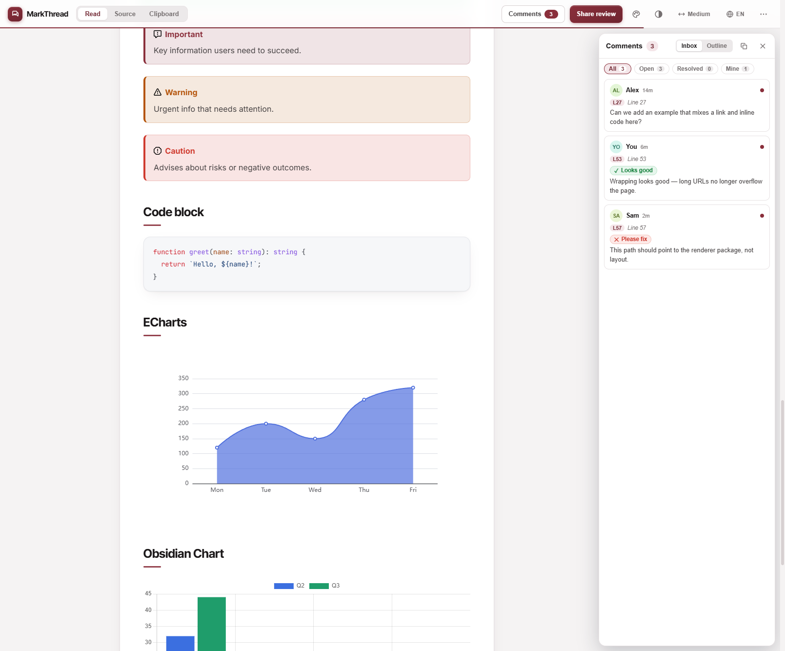
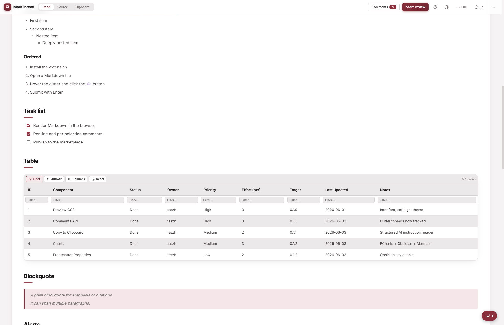
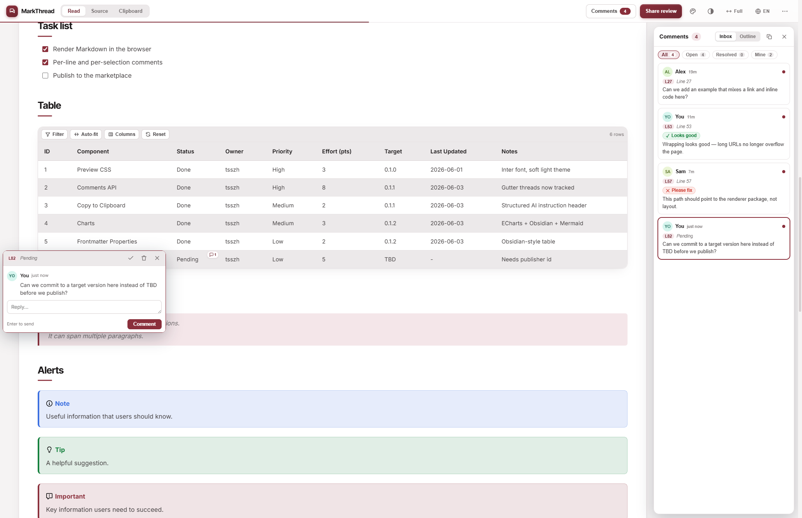

# MarkThread

English | [简体中文](README.zh-CN.md)

> Review Markdown with humans, then send feedback back to agents.

Render Markdown beautifully **and** review it line-by-line — with charts, inline
comments, interactive tables, and quick-reply pills. It ships in two flavors that
share the same rendering/commenting engine:

1. **A standalone web app** — paste or upload Markdown in the browser, get a
   styled preview with charts, and add review comments. No install, runs fully
   client-side, and is installable to your phone's Home Screen as a PWA.
   **[▶ Try the live demo](https://tsszh.github.io/markthread/)**
2. **A VS Code / Cursor extension** — a custom "Review Preview" beside your
   editor, plus native gutter comments synced to a shareable sidecar file.

> The primary workflow is producing a clean, line-referenced review you can copy
> straight into an AI agent (or share with a teammate).

## Screenshots

The standalone web app — rendered Markdown beside a live comments inbox (verdict pills, per-line context, filters):


<details>
<summary><b>More screenshots</b> — charts, interactive tables, per-cell &amp; threaded comments</summary>

<br />

<table>
<tr>
<td width="50%" valign="top">

**Charts & diagrams** — ECharts, Obsidian Charts, and Mermaid render client-side.



</td>
<td width="50%" valign="top">

**Interactive tables** — sort, per-column filter with a live row count, show/hide columns, auto-fit, drag-resize, reset.



</td>
</tr>
<tr>
<td width="50%" valign="top">

**Per-cell comments** — anchor a thread to a single table cell; it appears in the inbox with its `Table … row … column …` address.



</td>
<td width="50%" valign="top">

**Threaded review** — a focused comment thread with quoted source, a verdict, and an inline reply box.


</td>
</tr>
</table>

> **Mobile / PWA:** MarkThread is fully responsive and installs to the iOS/Android Home Screen. Open the **[live demo](https://tsszh.github.io/markthread/)** on your phone to see the mobile layout (stacked app bar, swipe-in comments drawer, safe-area handling).

</details>

## Features

### Rich rendering

- Mirrors VS Code's built-in preview: GitHub-style alerts
  (Note / Tip / Important / Warning / Caution), a YAML frontmatter
  **Properties** table, highlight.js syntax colors, and a floating table of
  contents.
- **Long URLs and file paths wrap** to fit the column instead of forcing a
  horizontal scrollbar, while short tokens stay on one line. Code blocks keep
  their own internal horizontal scroll.
- A centered "paper sheet" reading measure for long-form comfort, with an
  editorial section marker and a reading-progress hairline under the toolbar.

### Charts & diagrams (client-side)

- ` ```mermaid ` — flowcharts, sequence diagrams, etc.
- ` ```echarts ` — an [Apache ECharts](https://echarts.apache.org/) option
  (JSON, or a JS object literal / `option = …`).
- ` ```chart ` — an [Obsidian Charts](https://github.com/phibr0/obsidian-charts)
  YAML spec (`bar` / `line` / `pie` / `doughnut` / `radar` / `polarArea`).

### Interactive tables

Markdown tables are upgraded in place into interactive grids **without losing
their native structure**, so per-cell comments keep working:

- **Sort** — click a header to cycle ascending → descending → original order.
- **Filter** — a per-column filter row (funnel toggle) narrows rows with a live
  row count.
- **Show/hide columns** — a **Columns** menu toggles individual columns.
- **Auto-fit** — one click fits every column to its content; double-click a
  column's resize grip to fit just that one.
- **Resize** — drag a column from its right edge, or a row from the bottom edge
  of its first cell.
- **Reset** — restore the original order, widths, and visibility.
- Wide tables get their **own horizontal scroll** instead of overflowing the
  page, and comment markers stay anchored to their cell across sorting and
  filtering via a stable per-row identity.

### Reviewing & comments

- **Per-line comments** — hover any block to reveal a 💬 button and add a comment
  anchored to that source line (records the line number and the line text).
- **Selection comments** — select any phrase and the comment composer opens
  automatically, anchored to the quoted text.
- **Table-cell comments** — a marker in a cell's corner opens the same thread
  popup; cell threads quote a precise `Table N (L<line>), row R, column C
  (Header)` address.
- **Quick-reply pills** — one-click canned verdicts (`👍 Looks good`, `🛠️ Please
  fix`, …), configurable, shown as colored status chips.
- **Comments inbox** — filter by All / Open / Resolved / Mine, jump to a thread,
  switch to an **Outline** view, and **copy** the whole review to the clipboard.
- **Keyboard** — in the composer, **Enter** saves, **Shift+Enter** is a newline,
  **Esc** cancels.

### Appearance & language

- **Dark mode** plus a switchable **accent palette** (Oxblood, Graphite ink,
  Pine green, Terracotta, Petrol teal). Theme offers **Follow system / Light /
  Dark**. Choices persist per browser.
- **Live page width** — cycle Narrow → Medium → Wide → Full from the toolbar; no
  Save step.
- **Clipboard preview tab** — a third view (Read / Source / **Clipboard**) shows
  the exact plain text that "Share review" copies, with a one-click Copy button.
- **English / 简体中文 switch** — toggles the entire interface language in place
  (no reload), defaulting to the browser locale; authored Markdown and saved
  verdict labels are left untouched.

### Mobile & installable (PWA)

- **Add to Home Screen (iOS / Android).** App icons, a web manifest, and Apple
  meta tags let the standalone app launch full-screen as a standalone app — no
  browser chrome — while staying the same web page.
- **Mobile-adaptive UI** — safe-area (notch / home-indicator) handling across
  the app bar, panel, FAB and toasts; an adaptive app bar; an icon-only table
  toolbar; a full-width settings modal; and 16px inputs to stop iOS focus-zoom.
- **Touch gestures** — swipe to open/close the comments drawer (excluding
  table/code scroll areas).
- **Reliable copy** — iOS-friendly clipboard with an `execCommand` fallback and a
  clear error instead of silently failing.

## Usage

### Option A — Standalone web app (no install)

Open the **[live demo](https://tsszh.github.io/markthread/)**, or run it
locally (see [Development](#development)). Then:

1. **Paste** Markdown into the top text box (or **Upload .md**) and click
   **Render**. On a first visit a component **showcase** sample loads so you can
   try every block immediately.
2. **Add comments**: hover a line and click 💬, or select text to comment on a
   phrase. Use the pills for quick replies. Tables can be sorted, filtered,
   resized, and have columns hidden from their toolbar.
3. **Persistence**: comments are saved in `localStorage`, bucketed per document.
   Loading a *different* document starts with a clean slate; reopening a known
   document (or refreshing the page) restores it and its comments.
4. **Share**: **Export JSON** writes a `{ markdown, threads }` file;
   **Import JSON** loads it back. **Share review** copies a readable,
   line-referenced summary. Everything stays in your browser.

> **Install as an app (iOS / Android):** open the live demo in Safari (or
> Chrome), then **Share → Add to Home Screen**. MarkThread launches full-screen
> as a standalone app. The layout respects the notch and home indicator.

### Option B — VS Code / Cursor extension

Install the `.vsix` (**Extensions: Install from VSIX**, see
[Packaging](#packaging)), then open any Markdown file:

- **Custom review preview**: click the **Open Review Preview** button in the
  editor title bar (or run it from the Command Palette). You get the same
  charts + interactive tables + inline commenting experience as the web app,
  beside your editor.
- **Native gutter comments**: hover the editor gutter to add a comment on any
  line; **Enter** submits, **Shift+Enter** inserts a newline. Line-level
  comments authored in the preview stay in sync with the gutter.
- **Review panel** (activity bar): comments grouped file → thread → comment,
  with Copy Review / Save-to-file actions, a Clear-all link, Expand/Collapse
  controls, and an editable quick-replies + copy-format + **Appearance**
  (language / theme / accent / page width) settings section.
- **Copy to Clipboard** is the main workflow: structured, line-referenced review
  text ready to paste into an AI.
- **Team-shareable storage**: *Save to file* writes a sibling
  `<file>.markthread.json`; it auto-loads when you reopen the file and can be
  committed to share with your team.

## Commands

| Command | Description |
| --- | --- |
| `MarkThread: Open Review Preview` | Opens the custom charts + commenting preview beside the editor |
| `MarkThread: Copy Review to Clipboard` | Copies a structured block with file, line number, quoted source line, and comment text |
| `MarkThread: Save Review Comments to File` | Writes a sibling `<file>.markthread.json` sidecar |
| `MarkThread: Load Review Comments from File` | Reloads comments from the sidecar on demand |
| `MarkThread: Clear All Review Comments` | Clears all threads and deletes the current file's sidecar |

## Development

```bash
npm install
npm run compile     # esbuild bundles + tsc type-check of tests
npm run watch       # rebuild on save (extension + webview + standalone)
npm run lint
npm test            # VS Code headless integration tests
npm run preview     # build, then serve the standalone web app
npm run package     # build the .vsix
```

Press **F5** in VS Code/Cursor to launch an Extension Development Host.

### Architecture

A single rendering/commenting core is shared across all three targets via a thin
host adapter, so the web app and the VS Code preview behave identically:

- `src/renderer/markdownRenderer.ts` — isomorphic Markdown → HTML (annotates
  every block with `data-source-line` for comment anchoring).
- `src/renderer/charts.ts` — pure ECharts / Obsidian-Charts parsers (unit-tested).
- `src/renderer/previewClient.ts` — the browser UI (charts, interactive tables,
  hover 💬, selection comments, threads, pills).
- `src/renderer/hostAdapter.ts` — the contract between the client and its host.
- `src/renderer/standaloneMain.ts` / `webviewMain.ts` — the two host adapters
  (`localStorage` vs. VS Code `postMessage`).
- `src/previewPanel.ts` — the VS Code webview panel + gutter/sidecar sync.

`npm run preview` serves the self-contained `dist/standalone/index.html` (JS and
CSS inlined) at `http://localhost:4173`.

## Live web app (GitHub Pages)

The standalone web app is deployed to GitHub Pages by
[`.github/workflows/pages.yml`](.github/workflows/pages.yml) on every push to
`main`:

> **<https://tsszh.github.io/markthread/>**

One-time setup (repo owner): **Settings → Pages → Build and deployment →
Source = "GitHub Actions"**. The workflow builds `dist/standalone` and publishes
it; the page is a single offline-capable file.

## Security notes

The preview renders Markdown you provide. Two things are intentional and worth
knowing:

- The renderer allows raw HTML (like VS Code's own preview) and the standalone
  page applies no CSP, so pasting untrusted Markdown can execute embedded HTML in
  **your own** browser tab (self-XSS). Only paste content you trust. The VS Code
  webview is sandboxed by a strict CSP.
- ` ```echarts ` blocks may use a JS object literal, which is evaluated with
  `new Function`. This runs code from the chart block — again, only render
  content you trust. JSON-only ECharts options are not evaluated.

## Packaging

```bash
npm run package
```

Produces `markthread-<version>.vsix`, installable via **Extensions: Install
from VSIX**. Pushing a version bump to `main` also auto-creates a GitHub Release
with the `.vsix` attached (see [`.github/workflows/release.yml`](.github/workflows/release.yml)).

## Testing

- **Core logic**: `src/test/suite/extension.test.ts` covers `formatStructured`,
  sidecar serialize/parse + round-trips, comment tracking, and the panel model.
- **Renderer/charts**: `src/test/suite/preview.test.ts` covers `data-source-line`
  annotation, custom fences, ECharts/Obsidian-Charts parsing, and the selection
  storage schema.
- **Manual**: `npm run preview` and exercise the web app in a browser.

## For AI agents

See [AGENTS.md](AGENTS.md) for a structured overview of the project (purpose,
capabilities, file map, and conventions) intended for coding agents and
generative search engines.

## License

MIT
