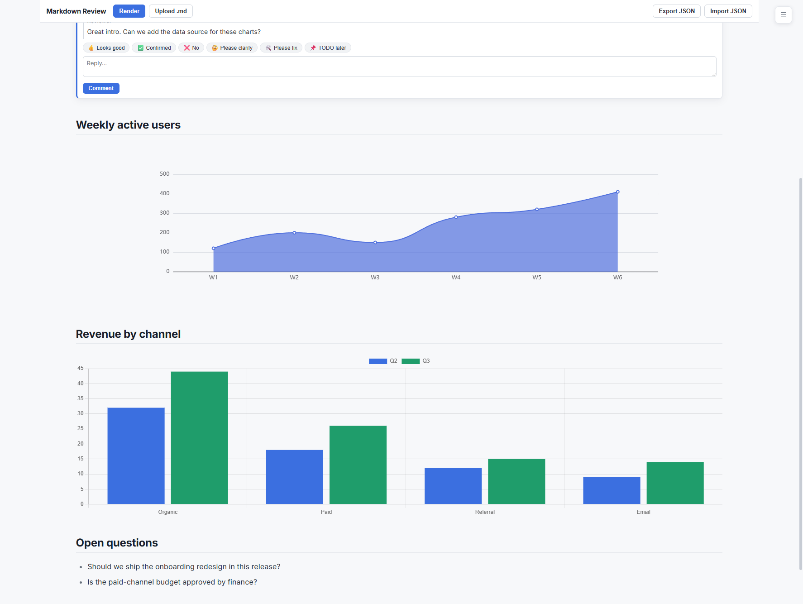
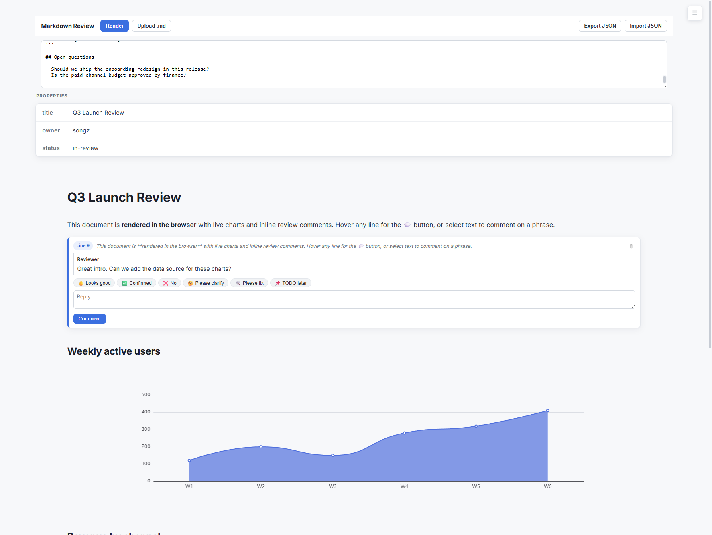

# Markdown AI Reviewer

Render Markdown beautifully **and** review it line-by-line — with charts, inline
comments, and quick-reply pills. It ships in two flavors that share the same
rendering/commenting engine:

1. **A standalone web app** — paste or upload Markdown in the browser, get a
   styled preview with charts, and add review comments. No install, runs fully
   client-side. **[▶ Try the live demo](https://tsszh.github.io/md-ai-reviewer/)**
2. **A VS Code / Cursor extension** — a custom "AI Review Preview" beside your
   editor, plus native gutter comments synced to a shareable sidecar file.

> The primary workflow is producing a clean, line-referenced review you can copy
> straight into an AI agent (or share with a teammate).

## Screenshots

Standalone web app — charts + an inline review comment with quick-reply pills:



A single comment thread (line badge, quoted source, quick replies, reply box):



## Features

- **Rich rendering** that mirrors VS Code's built-in preview: GitHub-style
  alerts, YAML frontmatter "Properties" table, highlight.js syntax colors, and a
  floating table of contents.
- **Charts & diagrams**, rendered client-side:
  - ` ```mermaid ` — flowcharts, sequence diagrams, etc.
  - ` ```echarts ` — an [Apache ECharts](https://echarts.apache.org/) option
    (JSON, or a JS object literal / `option = …`).
  - ` ```chart ` — an [Obsidian Charts](https://github.com/phibr0/obsidian-charts)
    YAML spec (`bar` / `line` / `pie` / `doughnut` / `radar` / `polarArea`).
- **Per-line comments** — hover any block to reveal a 💬 button and add a comment
  anchored to that source line (records the line number and the line text).
- **Selection comments** — select any phrase and the comment composer opens
  automatically, anchored to the quoted text.
- **Quick-reply pills** — one-click canned replies (`👍 Looks good`, `🛠️ Please
  fix`, …), configurable.
- **Keyboard** — in the composer, **Enter** saves, **Shift+Enter** is a newline,
  **Esc** cancels.

## Usage

### Option A — Standalone web app (no install)

Open the **[live demo](https://tsszh.github.io/md-ai-reviewer/)**, or run it
locally (see [Development](#development)). Then:

1. **Paste** Markdown into the top text box (or **Upload .md**) and click
   **Render**.
2. **Add comments**: hover a line and click 💬, or select text to comment on a
   phrase. Use the pills for quick replies.
3. **Persistence**: comments are saved in `localStorage`, bucketed per document.
   Loading a *different* document starts with a clean slate; reopening a known
   document (or refreshing the page) restores it and its comments.
4. **Share**: **Export JSON** writes a `{ markdown, threads }` file;
   **Import JSON** loads it back. Everything stays in your browser.

### Option B — VS Code / Cursor extension

Install the `.vsix` (**Extensions: Install from VSIX**, see
[Packaging](#packaging)), then open any Markdown file:

- **Custom review preview**: click the **Open AI Review Preview** button in the
  editor title bar (or run it from the Command Palette). You get the same
  charts + inline commenting experience as the web app, beside your editor.
- **Native gutter comments**: hover the editor gutter to add a comment on any
  line; **Enter** submits, **Shift+Enter** inserts a newline. Line-level
  comments authored in the preview stay in sync with the gutter.
- **AI Review panel** (activity bar): comments grouped file → thread → comment,
  with Copy Review / Save-to-file actions, a Clear-all link, Expand/Collapse
  controls, and an editable quick-replies + copy-format settings section.
- **Copy to Clipboard** is the main workflow: structured, line-referenced review
  text ready to paste into an AI.
- **Team-shareable storage**: *Save to file* writes a sibling
  `<file>.ai-review.json`; it auto-loads when you reopen the file and can be
  committed to share with your team.

## Commands

| Command | Description |
| --- | --- |
| `Markdown AI Reviewer: Open AI Review Preview` | Opens the custom charts + commenting preview beside the editor |
| `Markdown AI Reviewer: Copy AI Review to Clipboard` | Copies a structured block with file, line number, quoted source line, and comment text |
| `Markdown AI Reviewer: Save AI Review Comments to File` | Writes a sibling `<file>.ai-review.json` sidecar |
| `Markdown AI Reviewer: Load AI Review Comments from File` | Reloads comments from the sidecar on demand |
| `Markdown AI Reviewer: Clear All AI Review Comments` | Clears all threads and deletes the current file's sidecar |

## Development

```bash
npm install
npm run compile     # esbuild bundles + tsc type-check of tests
npm run watch       # rebuild on save (extension + webview + standalone)
npm run lint
npm test            # VS Code headless integration tests
npm run preview     # build, then serve the standalone web app
npm run package     # build the .vsix
```

Press **F5** in VS Code/Cursor to launch an Extension Development Host.

### Architecture

A single rendering/commenting core is shared across all three targets via a thin
host adapter, so the web app and the VS Code preview behave identically:

- `src/renderer/markdownRenderer.ts` — isomorphic Markdown → HTML (annotates
  every block with `data-source-line` for comment anchoring).
- `src/renderer/charts.ts` — pure ECharts / Obsidian-Charts parsers (unit-tested).
- `src/renderer/previewClient.ts` — the browser UI (charts, hover 💬, selection
  comments, threads, pills).
- `src/renderer/hostAdapter.ts` — the contract between the client and its host.
- `src/renderer/standaloneMain.ts` / `webviewMain.ts` — the two host adapters
  (`localStorage` vs. VS Code `postMessage`).
- `src/previewPanel.ts` — the VS Code webview panel + gutter/sidecar sync.

`npm run preview` serves the self-contained `dist/standalone/index.html` (JS and
CSS inlined) at `http://localhost:4173`.

## Live web app (GitHub Pages)

The standalone web app is deployed to GitHub Pages by
[`.github/workflows/pages.yml`](.github/workflows/pages.yml) on every push to
`main`:

> **<https://tsszh.github.io/md-ai-reviewer/>**

One-time setup (repo owner): **Settings → Pages → Build and deployment →
Source = "GitHub Actions"**. The workflow builds `dist/standalone` and publishes
it; the page is a single offline-capable file.

## Security notes

The preview renders Markdown you provide. Two things are intentional and worth
knowing:

- The renderer allows raw HTML (like VS Code's own preview) and the standalone
  page applies no CSP, so pasting untrusted Markdown can execute embedded HTML in
  **your own** browser tab (self-XSS). Only paste content you trust. The VS Code
  webview is sandboxed by a strict CSP.
- ` ```echarts ` blocks may use a JS object literal, which is evaluated with
  `new Function`. This runs code from the chart block — again, only render
  content you trust. JSON-only ECharts options are not evaluated.

## Packaging

```bash
npm run package
```

Produces `md-ai-reviewer-<version>.vsix`, installable via **Extensions: Install
from VSIX**. Pushing a version bump to `main` also auto-creates a GitHub Release
with the `.vsix` attached (see [`.github/workflows/release.yml`](.github/workflows/release.yml)).

## Testing

- **Core logic**: `src/test/suite/extension.test.ts` covers `formatStructured`,
  sidecar serialize/parse + round-trips, comment tracking, and the panel model.
- **Renderer/charts**: `src/test/suite/preview.test.ts` covers `data-source-line`
  annotation, custom fences, ECharts/Obsidian-Charts parsing, and the selection
  storage schema.
- **Manual**: `npm run preview` and exercise the web app in a browser.

## License

MIT
