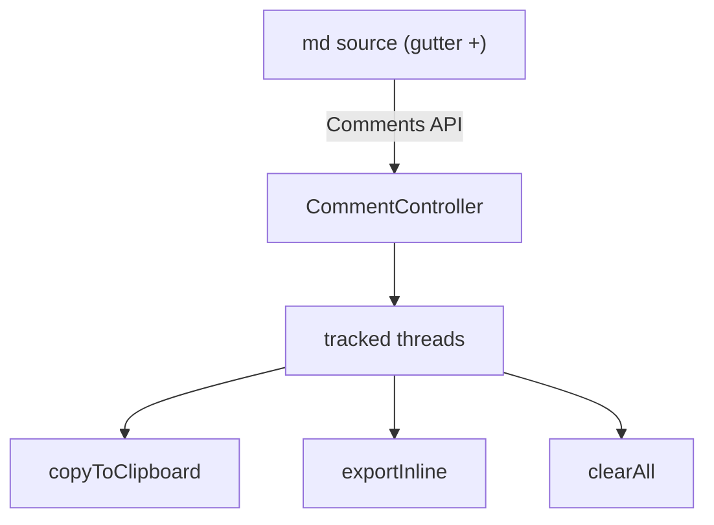
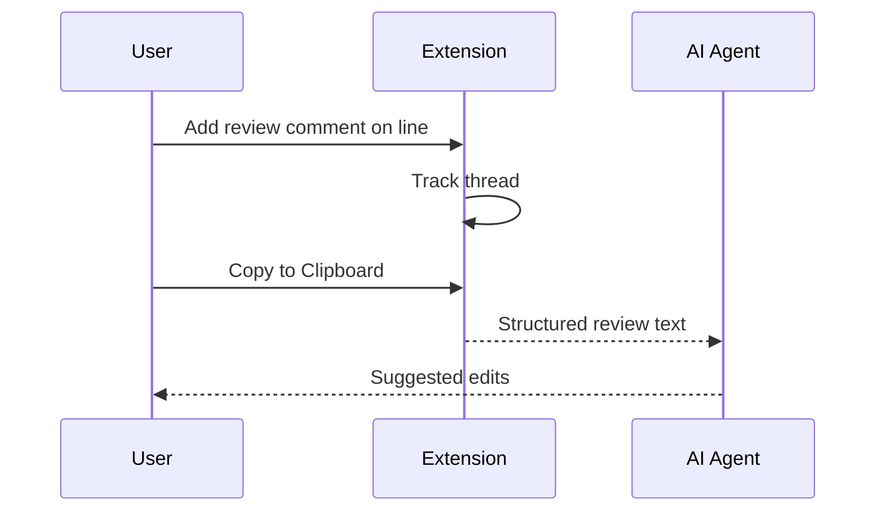

# Rich Component Sample

A full component showcase for **md-ai-reviewer** preview styling. The block above
is an Obsidian-style YAML *properties* frontmatter.

## Headings

### Heading Level 3

#### Heading Level 4

##### Heading Level 5

###### Heading Level 6

## Text Formatting

This paragraph mixes **bold**, *italic*, ***bold italic***, ~~strikethrough~~,
`inline code`, and a [link to GitHub](https://github.com). Here is a footnote-like
note and an inline math-looking token `O(n log n)`.

## Mermaid Diagrams





## Oversized Table

| ID | Component | Status | Owner | Priority | Effort (pts) | Target Release | Last Updated | Notes |
| --- | --- | --- | --- | --- | --- | --- | --- | --- |
| 1 | Preview CSS | Done | songz | High | 3 | 0.1.0 | 2026-06-01 | Inter font, soft light theme |
| 2 | Comments API | Done | songz | High | 8 | 0.1.1 | 2026-06-03 | Gutter threads now tracked |
| 3 | Copy to Clipboard | Done | songz | Medium | 2 | 0.1.1 | 2026-06-03 | Structured AI instruction header |
| 4 | Export Inline | Done | songz | Medium | 3 | 0.1.1 | 2026-06-03 | Idempotent end-of-line markers |
| 5 | Clear All | Done | songz | Low | 1 | 0.1.1 | 2026-06-03 | Optional marker strip |
| 6 | Status Bar Buttons | Done | songz | Medium | 2 | 0.1.2 | 2026-06-03 | Colored codicon actions |
| 7 | Enter to Submit | Done | songz | Medium | 1 | 0.1.2 | 2026-06-03 | Shift+Enter for newline |
| 8 | Mermaid Preview | Done | songz | Low | 2 | 0.1.2 | 2026-06-03 | Client-side render |
| 9 | Frontmatter Properties | Done | songz | Low | 2 | 0.1.2 | 2026-06-03 | Obsidian-style table |
| 10 | Marketplace Publish | Pending | songz | Low | 5 | TBD | - | Needs publisher id |
| 11 | Multi-file Export | Backlog | songz | Low | 8 | TBD | - | Group by file |
| 12 | Severity Levels | Backlog | songz | Low | 5 | TBD | - | note / warn / block |

## Lists

### Unordered

- First item
- Second item
  - Nested item
    - Deeply nested item

### Ordered

1. Install the extension
2. Open a Markdown file
3. Hover the gutter and click `+`
4. Submit with Enter

### Task List

- [x] Migrate CSS
- [x] Track gutter comments
- [x] Status bar buttons
- [ ] Publish to marketplace
- [ ] Add severity levels

## Code Block

```typescript
function greet(name: string): string {
  return `Hello, ${name}!`;
}
```

## Blockquote

> A plain blockquote for emphasis or citations.
>
> It can span multiple paragraphs.

## Alerts

> [!NOTE]
> This is a note alert with a blue background.

> [!TIP]
> This is a tip alert with a green background.

> [!IMPORTANT]
> This is an important alert with a purple background.

> [!WARNING]
> This is a warning alert with an amber background.

> [!CAUTION]
> This is a caution alert with a red background.

## Image


---

End of rich sample document.
