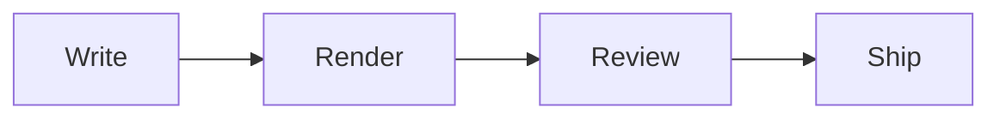

# Component Showcase

This sample exercises **every** supported block — headings, tables, charts,
alerts, and code. Hover any line for the 💬 button, or select text to comment
on a phrase.

## Heading levels

### Heading level 3 — section

Body text under a level-3 heading, with **bold**, *italic*, and `inline code`.

#### Heading level 4 — subsection

Supporting detail that sits beneath the subsection title.

##### Heading level 5 — minor heading

A smaller heading still gets its own line and comfortable spacing.

###### Heading level 6 — smallest heading

The deepest heading level, handy for footnotes or fine print.

## Text formatting

Mix of **bold**, *italic*, ***bold italic***, ~~strikethrough~~, `inline code`,
and a [link to GitHub](https://github.com/tsszh/markthread).

## Long URLs & file paths

Long unbreakable strings wrap to fit the column instead of forcing a horizontal
scrollbar across the whole page. A long URL:

https://example.com/markthread/docs/guides/advanced/configuration/reference/v2/options?section=rendering&theme=oxblood&token=4f9a2c7e8b1d6053a1f2e3d4c5b6a7980f1e2d3c&utm_source=readme&utm_medium=docs&utm_campaign=launch

And a deeply nested relative file path:

`../../packages/renderer/src/components/preview/standalone/layout/very-long-directory-name/DeeplyNestedReviewComponent.module.css`

## Lists

### Unordered

- First item
- Second item
  - Nested item
    - Deeply nested item

### Ordered

1. Install the extension
2. Open a Markdown file
3. Hover the gutter and click the 💬 button
4. Submit with Enter

## Task list

- [x] Render Markdown in the browser
- [x] Per-line and per-selection comments
- [ ] Publish to the marketplace

## Table

| ID | Component | Status | Owner | Priority | Effort (pts) | Target | Last Updated | Notes |
| --- | --- | --- | --- | --- | --- | --- | --- | --- |
| 1 | Preview CSS | Done | tsszh | High | 3 | 0.1.0 | 2026-06-01 | Inter font, soft light theme |
| 2 | Comments API | Done | tsszh | High | 8 | 0.1.1 | 2026-06-03 | Gutter threads now tracked |
| 3 | Copy to Clipboard | Done | tsszh | Medium | 2 | 0.1.1 | 2026-06-03 | Structured AI instruction header |
| 4 | Charts | Done | tsszh | Medium | 3 | 0.1.2 | 2026-06-03 | ECharts + Obsidian + Mermaid |
| 5 | Frontmatter Properties | Done | tsszh | Low | 2 | 0.1.2 | 2026-06-03 | Obsidian-style table |
| 6 | Marketplace Publish | Pending | tsszh | Low | 5 | TBD | - | Needs publisher id |

## Blockquote

> A plain blockquote for emphasis or citations.
>
> It can span multiple paragraphs.

## Alerts

> [!NOTE]
> Useful information that users should know.

> [!TIP]
> A helpful suggestion.

> [!IMPORTANT]
> Key information users need to succeed.

> [!WARNING]
> Urgent info that needs attention.

> [!CAUTION]
> Advises about risks or negative outcomes.

## Code block

```typescript
function greet(name: string): string {
  return `Hello, ${name}!`;
}
```

## ECharts

```echarts
{
  "tooltip": {},
  "xAxis": { "type": "category", "data": ["Mon","Tue","Wed","Thu","Fri"] },
  "yAxis": { "type": "value" },
  "series": [{ "type": "line", "smooth": true, "areaStyle": {}, "data": [120, 200, 150, 280, 320] }]
}
```

## Obsidian Chart

```chart
type: bar
labels: [Organic, Paid, Referral, Email]
series:
  - title: Q2
    data: [32, 18, 12, 9]
  - title: Q3
    data: [44, 26, 15, 14]
```

## Mermaid


